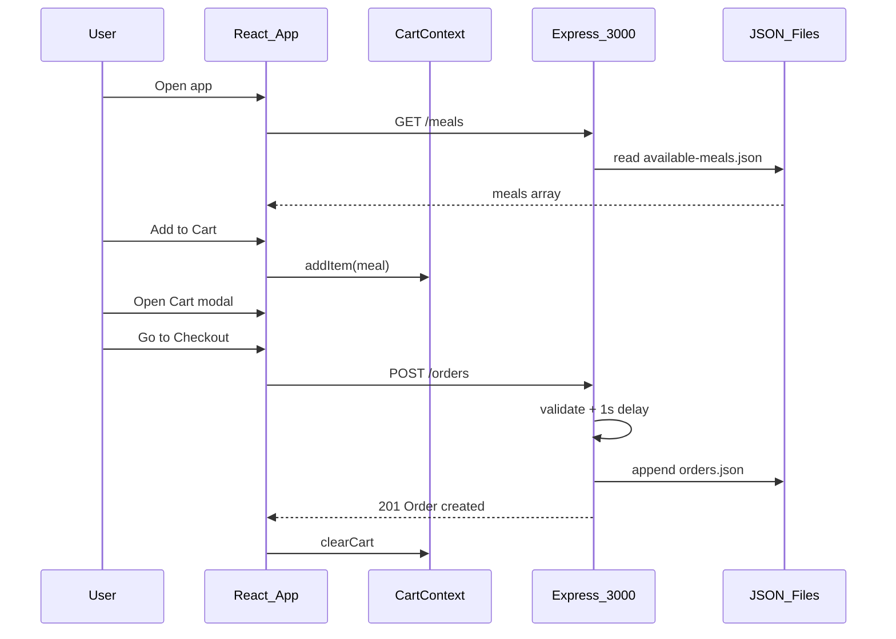

# Food App — Deep Interview Q&A (Simple Answers)

Yeh tumhara **React 19 + Vite** frontend aur **Express 4** backend wala food ordering app hai. User meals dekhta hai, cart mein add karta hai, checkout form bharta hai, order backend par save hota hai.

---

## Project at a glance

| Layer | Tech | Main files |
|-------|------|------------|
| Frontend | React 19, Vite, Context, custom hook | [`src/App.jsx`](src/App.jsx), [`src/store/CartContext.jsx`](src/store/CartContext.jsx), [`src/hooks/useHttp.js`](src/hooks/useHttp.js) |
| Backend | Express, JSON files | [`backend/app.js`](backend/app.js), [`backend/data/available-meals.json`](backend/data/available-meals.json), [`backend/data/orders.json`](backend/data/orders.json) |
| Ports | Frontend ~5173 (Vite), Backend **3000** | Hardcoded URLs |

**Features:** Menu list, cart (+/−), checkout modal, POST order. **No:** login, React Router, order history page, real database.

---

## Full code workflow (yeh diagram yaad rakho)



### Step-by-step (simple)

1. **App start** — [`main.jsx`](src/main.jsx) → [`App.jsx`](src/App.jsx) wraps `UserProgressContext` + `CartContext`.
2. **Meals load** — [`Meals.jsx`](src/components/Meals.jsx) calls `useHttp('http://localhost:3000/meals')` → auto GET on mount.
3. **Add to cart** — [`MealItem.jsx`](src/components/MealItem.jsx) → `cartCtx.addItem(meal)` → reducer `ADD_ITEM`.
4. **Cart modal** — Header/Cart → `showCart()` → `progress === 'cart'`.
5. **Checkout** — `showCheckout()` → form → `useActionState` → POST body `{ order: { items, customer } }`.
6. **Backend** — [`backend/app.js`](backend/app.js) validates, adds random `id`, writes [`orders.json`](backend/data/orders.json).
7. **Success** — Success modal → `clearCart()`, `clearData()`, hide checkout.

---

# SECTION A — Basic / Project overview

### Q1. Yeh project kya karta hai?
**Answer:** Online food menu app. User dishes dekhta hai, cart mein quantity badhata/ghatata hai, address form bhar ke order place karta hai. Order server par JSON file mein save hota hai.

### Q2. Tech stack kya hai?
**Answer:** Frontend: React 19 + Vite. Backend: Node + Express. Data: JSON files (no MongoDB/PostgreSQL). Styling: plain CSS in [`index.css`](src/index.css).

### Q3. Frontend aur backend alag kyun chalte hain?
**Answer:** Do alag servers — Vite dev server (UI) aur Express (API). Alag ports par CORS headers se browser ko doosre origin se API call karne dete hain.

### Q4. Kitne API endpoints hain?
**Answer:** Do main:
- `GET /meals` — menu
- `POST /orders` — naya order  
Plus static files `public/` se images (agar folder ho).

### Q5. Routing hai kya (pages)?
**Answer:** Nahi. Poora app ek screen hai. Cart aur checkout **modals** hain, URL change nahi hota. Navigation ke liye `UserProgressContext` use hota hai (`''`, `'cart'`, `'checkout'`).

### Q6. Database kahan hai?
**Answer:** Database nahi — `available-meals.json` (menu) aur `orders.json` (orders). Node `fs.readFile` / `writeFile` se padhta/likhta hai.

### Q7. Project kaise run karoge?
**Answer:**  
`cd backend && npm install && npm start` (port 3000)  
Root par `npm install && npm run dev` (Vite, ~5173)

---

# SECTION B — React & components

### Q8. `App.jsx` mein kya structure hai?
**Answer:** Nested providers, phir components:

```jsx
<UserProgressContextProvider>
  <CartContextProvider>
    <Header /><Meals /><Cart /><Checkout />
  </CartContextProvider>
</UserProgressContextProvider>
```

Providers upar isliye taaki sab children context access kar saken.

### Q9. Context API kya hai aur yahan kahan use hua?
**Answer:** React ka tarika **global state** share karne ka bina har level par props pass kiye.  
- `CartContext` — cart items  
- `UserProgressContext` — kaun sa modal open hai  

### Q10. `useReducer` vs `useState` — cart ke liye reducer kyun?
**Answer:** Cart mein multiple actions hain (add, remove, clear) aur state update logic lamba hai. Reducer ek jagah saari rules rakhta hai — test aur samajhna easy.

### Q11. `ADD_ITEM` reducer mein kya hota hai?
**Answer:** Agar same `meal.id` cart mein hai → `quantity + 1`. Nahi to naya item `{ ...meal, quantity: 1 }`. Immutable update: `[...state.items]`, purani array mutate nahi.

### Q12. `REMOVE_ITEM` kya karta hai?
**Answer:** Quantity 1 se zyada ho to minus 1. Quantity 1 ho to item array se hata deta hai (`splice`).

### Q13. Kyun `findIndex` use kiya?
**Answer:** Item ko id se dhundhne ke liye taaki sahi index par update ho.

### Q14. Modal kaise kaam karta hai?
**Answer:** [`Modal.jsx`](src/components/UI/Modal.jsx):
- HTML `<dialog>` element
- `createPortal` se content `#modal` div mein render (root ke bahar)
- `open` true → `showModal()`, cleanup par `close()`

### Q15. Portal kyun?
**Answer:** Modal DOM hierarchy se bahar render hota hai — z-index / overflow issues kam, accessibility ke liye bhi useful pattern.

### Q16. `Meals.jsx` loading/error kaise dikhata hai?
**Answer:** `useHttp` se `isLoading` / `error` aata hai. Loading → "Fetching meals...". Error → `<Error />` component.

### Q17. `Checkout.jsx` mein `useActionState` kya hai?
**Answer:** React 19 hook — form submit ko async action se jodta hai. `formAction` form par lagta hai, `isSending` submit ke dauran true — buttons hide kar "Sending..." dikhate hain.

### Q18. Form data kaise collect hota hai?
**Answer:** `FormData` + `Object.fromEntries(fd.entries())`. Har `Input` ka `id` = field name (`name`, `email`, `street`, `postal-code`, `city`) — backend validation inhi keys par hai.

### Q19. Cart total frontend par kaise calculate hota hai?
**Answer:**  
`items.reduce((total, item) => total + item.quantity * item.price, 0)`  
Note: `price` string hai JSON se — JavaScript coercion se multiply chal jata hai, production mein number better.

### Q20. `currencyFormatter` kya hai?
**Answer:** [`formatting.js`](src/util/formatting.js) mein `Intl.NumberFormat('en-US', { style: 'currency', currency: 'USD' })` — price display ke liye.

### Q21. Controlled vs uncontrolled inputs?
**Answer:** Yahan mostly **uncontrolled** — React state mein har keystroke store nahi; submit par `FormData` se values aati hain.

### Q22. `StrictMode` kyun?
**Answer:** [`main.jsx`](src/main.jsx) mein development mein extra checks (double render, deprecated APIs) — bugs pakadne ke liye.

---

# SECTION C — Custom hook `useHttp`

### Q23. `useHttp` kya karta hai?
**Answer:** `fetch` wrap karke `data`, `isLoading`, `error`, `sendRequest`, `clearData` deta hai. Non-OK response par server ka `message` throw karke `error` state set karta hai.

### Q24. Meals automatically kaise fetch hoti hain?
**Answer:** `useEffect` mein: agar config nahi ya method GET/absent hai → `sendRequest()` mount par call.

### Q25. Orders ke liye auto-fetch kyun nahi?
**Answer:** `Checkout` mein `method: 'POST'` — effect sirf GET par auto chalta hai. Order sirf form submit par `sendRequest(body)` se jata hai.

### Q26. `useCallback` kyun `sendRequest` par?
**Answer:** Function identity stable rakhi taaki `useEffect` dependency mein infinite loop na ho.

### Q27. Agar backend down ho to kya dikhega?
**Answer:** `fetch` fail → catch → `error` message set → `Meals` ya `Checkout` par `<Error />`.

---

# SECTION D — Backend & API

### Q28. Express app structure?
**Answer:** Single file [`backend/app.js`](backend/app.js): middleware → routes → 404 handler. Alag routes/controllers folders nahi.

### Q29. `body-parser` kya karta hai?
**Answer:** Request body ko JSON object mein parse karta hai taaki `req.body.order` mile.

### Q30. `GET /meals` flow?
**Answer:** `fs.readFile('./data/available-meals.json')` → `JSON.parse` → `res.json(array)`.

### Q31. `POST /orders` request body shape?
**Answer:**
```json
{
  "order": {
    "items": [{ "id", "name", "price", "quantity", ... }],
    "customer": { "name", "email", "street", "postal-code", "city" }
  }
}
```

### Q32. Backend validation kya karti hai?
**Answer:**  
- `order` null nahi, `items` empty nahi  
- Email mein `@`  
- name, street, postal-code, city trim ke baad empty nahi  
Fail → `400` + `{ message: "..." }`

### Q33. 1 second `setTimeout` kyun?
**Answer:** Slow network simulate karne ke liye (tutorial/demo) — loading state test karne ke liye.

### Q34. Order ID kaise generate hoti hai?
**Answer:** `(Math.random() * 1000).toString()` — simple lekin **unique guarantee nahi**, production mein UUID better.

### Q35. Order save kaise hota hai?
**Answer:** Poori `orders.json` read → array mein `push` → poori file dubara `writeFile`. Simple lekin concurrent orders par race condition ho sakti hai.

### Q36. Success response?
**Answer:** `201` + `{ message: "Order created!" }`

### Q37. CORS kya hai aur yahan kaise set hai?
**Answer:** Cross-Origin Resource Sharing — browser alag port (5173 vs 3000) par API block karta. Manual headers: `Allow-Origin: *`, methods GET/POST, header Content-Type. `OPTIONS` → 200.

### Q38. `cors` npm package kyun nahi?
**Answer:** Manual middleware se same kaam — project chota hai.

### Q39. Koi authentication hai?
**Answer:** Nahi — koi bhi order place kar sakta hai.

### Q40. Server price verify karta hai?
**Answer:** Nahi — client jo items bhejta hai wahi save hota hai. Production mein server menu se price match kare.

---

# SECTION E — Data & files

### Q41. Meal object structure?
**Answer:** `id`, `name`, `price` (string), `description`, `image` (relative path).

### Q42. Image URL kaise banti hai?
**Answer:** `MealItem` mein `src={\`http://localhost:3000/${meal.image}\`}` — Express `express.static('public')` se serve.

### Q43. `orders.json` mein kya store hota hai?
**Answer:** Array of orders: `items`, `customer`, server-generated `id`.

### Q44. Order history UI hai?
**Answer:** Frontend par nahi — sirf POST. Dekhne ke liye file kholo ya future mein `GET /orders` API banao.

---

# SECTION F — State flow (modal navigation)

### Q45. `UserProgressContext` values?
**Answer:**  
- `''` — koi modal nahi  
- `'cart'` — cart modal  
- `'checkout'` — checkout modal  

### Q46. Cart se checkout kaise jate hain?
**Answer:** Cart mein "Go to Checkout" → `showCheckout()` — `progress` `'checkout'` ho jata hai.

### Q47. Success ke baad kya cleanup hoti hai?
**Answer:** `hideCheckout()`, `clearCart()`, `clearData()` (HTTP hook reset).

---

# SECTION G — Medium / “Explain the code” questions

### Q48. Poora add-to-cart flow code level par?
**Answer:**  
`MealItem` button click → `addItem(meal)` → dispatch `ADD_ITEM` → reducer update → `CartContext` subscribers re-render → `Header` count badhe, `Cart` list update.

### Q49. Checkout submit flow?
**Answer:**  
Form submit → `checkoutAction` → `sendRequest(JSON.stringify({order:...}))` → `fetch POST` → backend validate + save → `data` set → success UI → user "Okay" → cleanup.

### Q50. Error backend se frontend tak kaise aata hai?
**Answer:** Backend `400` + `{ message }` → `useHttp` `!response.ok` → `throw new Error(message)` → catch → `setError` → `<Error message={error} />`.

### Q51. Kyun do alag Context, ek mein kyun nahi?
**Answer:** Separation of concerns — cart data alag concern hai, UI modal step alag. Mix kar sakte the lekin chhote app mein split readable hai.

### Q52. Component tree mein kaun context use karta hai?
**Answer:**  
- Cart: Header, MealItem, Cart, CartItem, Checkout  
- Progress: Header, Cart, Checkout  

### Q53. `Cart.jsx` kya dikhata hai?
**Answer:** Modal, line items (`CartItem`), total, Close, Go to Checkout (empty cart par hide).

### Q54. Key prop `meal.id` par kyun?
**Answer:** React list mein stable identity — reorder/update par sahi re-render.

---

# SECTION H — Deep / Senior / “Improve this” questions

### Q55. Production ke liye kya missing hai?
**Answer (bullet):**  
- Real DB (PostgreSQL/MongoDB)  
- Env variables (`PORT`, API URL)  
- Auth / payment  
- Server-side price & stock validation  
- Unique order IDs (UUID)  
- Error middleware + try/catch on file I/O  
- HTTPS, rate limiting  
- Order list API + admin panel  

### Q56. JSON file storage ke problems?
**Answer:** Concurrent writes corrupt kar sakte hain, scale nahi hota, query/search mushkil, backup/transaction nahi.

### Q57. Agar do users ek saath order karein?
**Answer:** Dono read → push → write — last write jeet sakta hai, ek order lost ho sakta hai. DB + transactions chahiye.

### Q58. `price` string hai — issue?
**Answer:** Display chal jata hai lekin calculation/rounding bugs ho sakte hain. Store paise mein integer (cents) ya number use karo.

### Q59. Security concerns?
**Answer:** No auth, CORS `*`, client-trusted items/price, no input sanitization for XSS (JSON API kam risk), no rate limit — interviewer ko batao awareness hai aur fix kya hoga.

### Q60. `=== null` validation ka gap?
**Answer:** Agar field **missing** ho (undefined), `orderData.customer.email === null` false — code crash kar sakta hai optional chaining / schema validation better.

### Q61. Redux kyun nahi?
**Answer:** App chota hai — Context + reducer kaafi. Redux tab jab bahut global state, middleware, devtools complexity chahiye.

### Q62. React Router add karoge to?
**Answer:** `/`, `/cart`, `/checkout` routes — deep linking, back button, shareable URLs. Ab modal + context se replace hoga partially.

### Q63. `useHttp` ko kaise improve karoge?
**Answer:** AbortController, retry, base URL from env, TypeScript types, separate hooks for GET vs mutation.

### Q64. Monolithic `app.js` ko kaise refactor?
**Answer:** `routes/meals.js`, `routes/orders.js`, `services/orderService.js`, `middleware/validateOrder.js`, `config/db.js`.

### Q65. Testing strategy?
**Answer:**  
- Unit: `cartReducer` pure functions  
- Integration: supertest se POST /orders  
- E2E: Playwright — add cart → checkout  
- Component: React Testing Library — Meals loading states  

### Q66. ES modules backend par?
**Answer:** `"type": "module"` in [`backend/package.json`](backend/package.json) — `import` syntax, `node app.js`.

### Q67. Vite kya karta hai?
**Answer:** Fast dev server, HMR, production build bundle — Create React App se zyada tez dev experience.

### Q68. Agar meals API slow ho?
**Answer:** Loading UI already hai. Improve: caching, skeleton UI, React Query stale-while-revalidate.

### Q69. Duplicate meal IDs in JSON?
**Answer:** Cart merge same `id` par — galat data se wrong behavior. Backend seed data consistent rakho.

### Q70. Deploy kaise karoge?
**Answer:** Frontend: Vite `npm run build` → Vercel/Netlify static. Backend: Railway/Render Node. API URL env se. CORS specific origin. JSON files persistent volume par ya DB migrate.

---

# SECTION I — Quick “one line” rapid fire

| Question | One-line answer |
|----------|-----------------|
| HTTP methods used? | GET meals, POST orders |
| Status codes? | 200 OK, 201 created, 400 bad request, 404 not found |
| Where is cart stored? | React memory (Context), not localStorage |
| Refresh par cart? | Lost — unless you add persistence |
| Port backend? | 3000 |
| `fetch` vs `axios`? | Native `fetch` in custom hook |
| `createContext` default values? | Placeholder functions — real values Provider se |
| Why `key={meal.id}`? | Stable list identity |
| `dialog` vs `motion`? | Native accessible modal, no extra lib |
| Body parser built into Express? | Haan newer Express mein bhi; yahan alag package bhi use |

---

# SECTION J — Hinglish mein common interviewer questions

### “Apna project 2 minute mein batao”
**Answer:** Maine ek full-stack food ordering app banaya. React frontend par user menu dekhta hai, Context se cart manage hota hai, modal se checkout. Express backend JSON file se meals serve karta hai aur orders save karta hai. Custom `useHttp` hook se API calls aur loading/error handle hote hain.

### “Sabse challenging part?”
**Answer (choose honest):** Cart reducer logic / modal + portal / async form with `useActionState` / backend validation matching form field names (`postal-code`).

### “Agar dubara banau to kya change?”
**Answer:** Database, env config, React Router, server price validation, TypeScript, tests, auth.

### “Tumne kya seekha?”
**Answer:** Context + reducer pattern, custom hooks, CORS split frontend/backend, REST API design, native dialog + portals, React 19 form actions.

---

## Files yaad rakhne ki list (interview se pehle 1 baar kholo)

1. [`src/App.jsx`](src/App.jsx) — tree  
2. [`src/store/CartContext.jsx`](src/store/CartContext.jsx) — reducer  
3. [`src/hooks/useHttp.js`](src/hooks/useHttp.js) — API  
4. [`src/components/Checkout.jsx`](src/components/Checkout.jsx) — order submit  
5. [`backend/app.js`](backend/app.js) — API + validation  

---

## 2-minute practice scripts (deep answers)

### Production gaps (Q55 expanded)

“Yeh app learning/demo ke liye solid hai, lekin production-ready nahi. Abhi data JSON files mein hai — scale, backup, aur concurrent writes ke liye database chahiye. API URL aur port hardcoded hain; `.env` se config karna chahiye. Security side par auth nahi hai, CORS `*` hai, aur server client ke bheje hue price/items par trust karta hai — real app mein server menu se verify karega. Order ID random float hai, UUID better. File read/write par try/catch aur global error handler missing hain. Deploy par HTTPS, rate limiting, aur order history API socho.”

### Redux kyun nahi (Q61 expanded)

“Is app ka global state sirf cart aur modal step hai — do Context, ek `useReducer`. Redux tab useful jab bahut saari slices, middleware, time-travel debugging, ya team scale par centralized store chahiye. Yahan Redux extra boilerplate deta bina clear benefit ke. Agar app bade — user login, order history, admin — tab Redux Toolkit ya Zustand consider karunga.”

### Concurrent JSON writes (Q57 expanded)

“`POST /orders` poori `orders.json` read karta hai, array push karta hai, phir poori file write. Agar do requests ek saath aayein, dono same purani file padh sakte hain, dono push karenge, jo baad mein write kare woh pehle wale order ko overwrite kar sakta hai — classic read-modify-write race. Fix: database with transactions, ya file locking, ya queue. Interview mein yeh dikhata hai main limitations samajhta hoon.”

---

## Practice tip

Har jawab ke saath **ek line code reference** bolo: “Jaise `cartReducer` mein `ADD_ITEM`…” — interviewer ko lagta hai tumne khud likha hai, sirf theory nahi.
