# Food App — Full Project Guide (Charts + Explanation)

Yeh document tumhare **ReactFood** project ko start se end tak explain karta hai — architecture, files, data flow, aur charts ke saath. Interview prep ke liye [`INTERVIEW.md`](INTERVIEW.md) alag rakho; yahan focus **samajhna aur visualize karna** hai.

---

## 1. Project kya hai?

Ek **full-stack food ordering web app** jisme:

- User restaurant ki **menu list** dekhta hai
- Dishes **cart** mein add/remove karta hai
- **Checkout form** bhar ke order place karta hai
- Order **backend** par save hota hai (JSON file)

| Part | Technology | Port |
|------|------------|------|
| Frontend (UI) | React 19 + Vite | ~5173 |
| Backend (API) | Node.js + Express 4 | 3000 |
| Storage | JSON files on disk | — |

**Nahi hai is app mein:** login, payment gateway, React Router pages, order history screen, real database.

---

## 2. High-level architecture

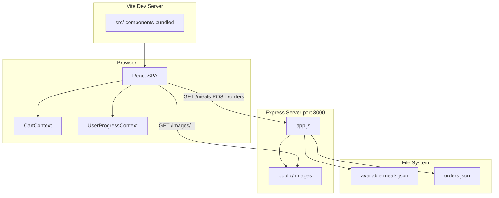

**Simple words:** Browser mein React chalta hai. API calls Express server par jaati hain. Server JSON files padhta/likhta hai. Images `public/` folder se aati hain.

---

## 3. Folder structure

```
foodapp/
├── index.html              # HTML shell + #root + #modal
├── package.json            # Frontend deps (React, Vite)
├── vite.config.js
├── src/
│   ├── main.jsx            # App entry
│   ├── App.jsx             # Providers + main layout
│   ├── index.css           # All styles
│   ├── components/
│   │   ├── Header.jsx
│   │   ├── Meals.jsx
│   │   ├── MealItem.jsx
│   │   ├── Cart.jsx
│   │   ├── CartItem.jsx
│   │   ├── Checkout.jsx
│   │   ├── Error.jsx
│   │   └── UI/             # Modal, Button, Input
│   ├── store/
│   │   ├── CartContext.jsx
│   │   └── UserProgressContext.jsx
│   ├── hooks/
│   │   └── useHttp.js
│   └── util/
│       └── formatting.js
└── backend/
    ├── app.js              # Entire API server
    ├── package.json
    └── data/
        ├── available-meals.json
        └── orders.json
```

---

## 4. Component tree (React)

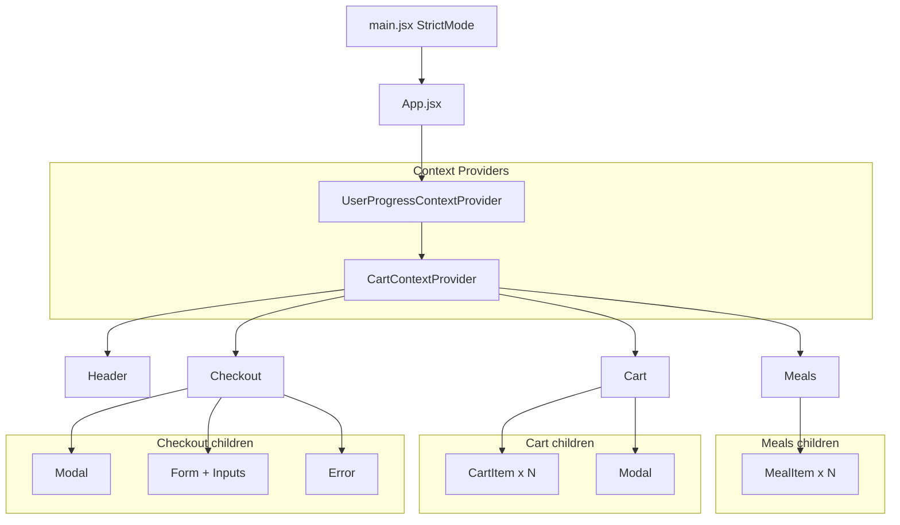

Har box ek `.jsx` file hai. **Cart** aur **Checkout** hamesha mount rehte hain lekin modal `open` prop se dikhte/chupte hain.

---

## 5. User journey (step by step)

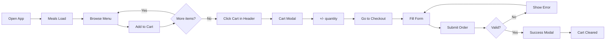

---

## 6. Complete request flow (technical)

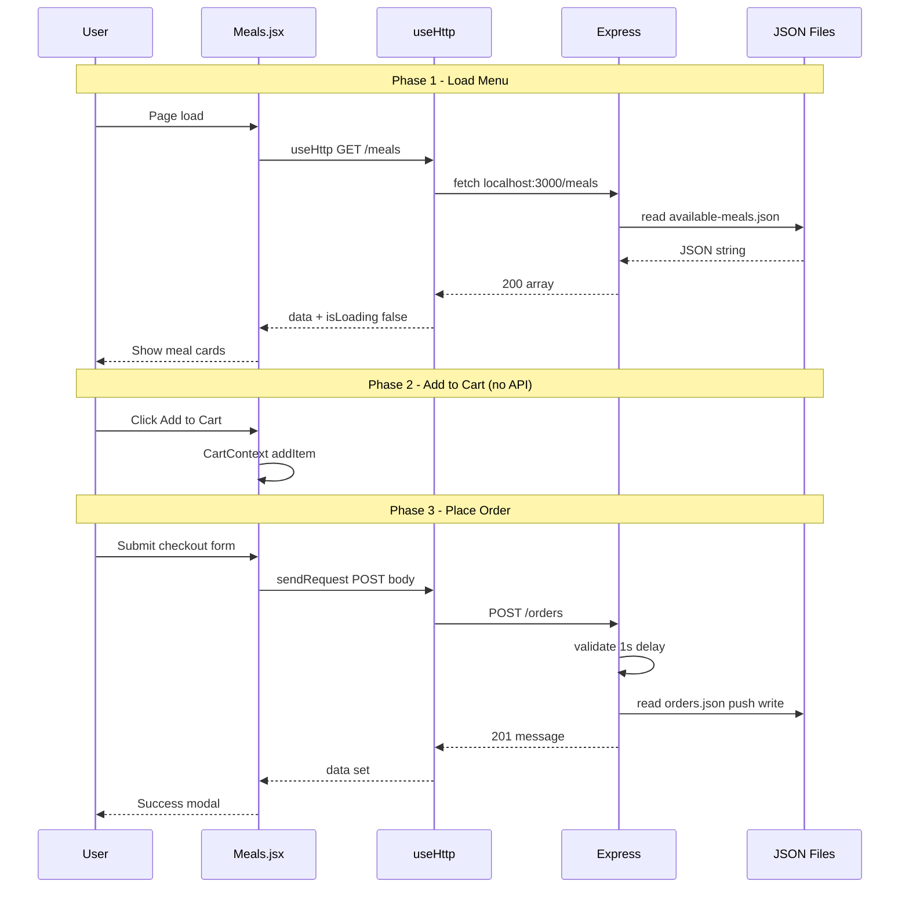

---

## 7. State management — do contexts

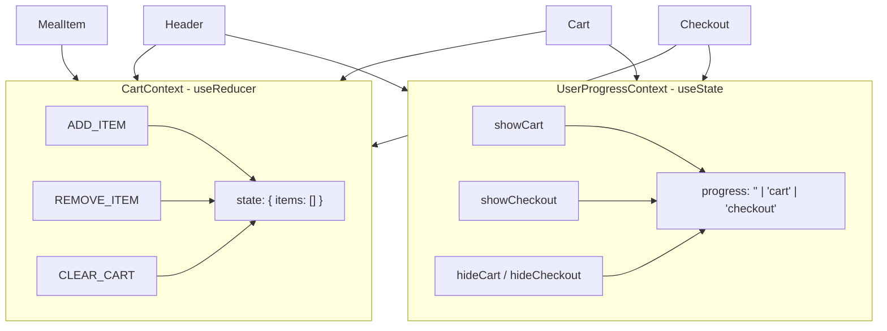

| Context | Storage | Purpose |
|---------|---------|---------|
| `CartContext` | `useReducer` | Cart items + quantity |
| `UserProgressContext` | `useState('')` | Kaun sa modal khula hai |

**Kyun alag?** Cart = **data**. Progress = **UI step**. Mix kar sakte the, alag rakhne se code clear rehta hai.

---

## 8. Cart reducer flow

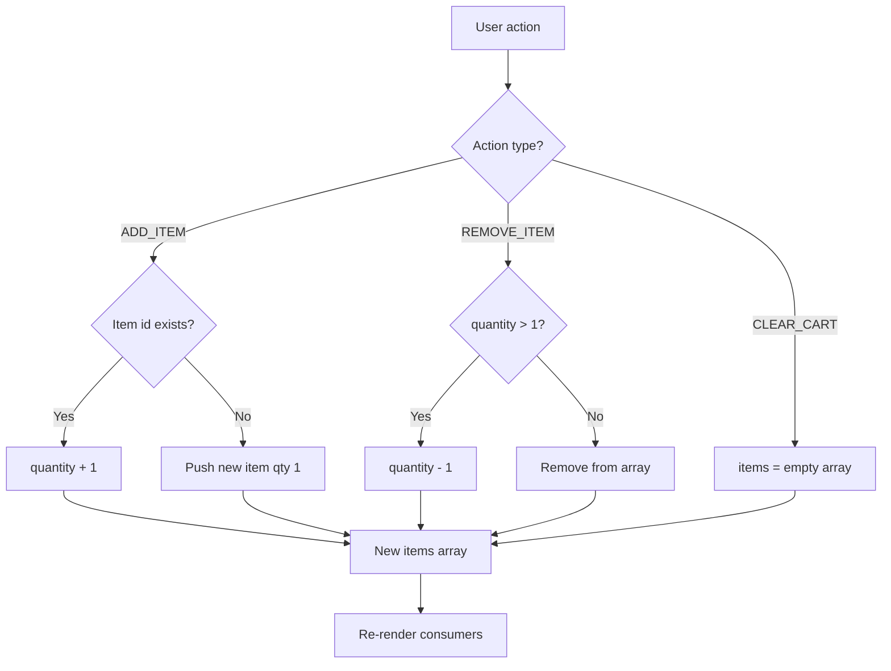

**File:** [`src/store/CartContext.jsx`](src/store/CartContext.jsx)

---

## 9. Modal system

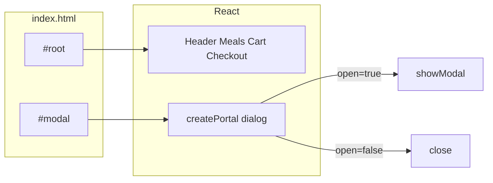

- **`<dialog>`** — browser ka native modal (accessibility better)
- **`createPortal`** — modal HTML `#modal` div mein render, `#root` ke bahar
- **`UserProgressContext.progress`** — `Cart` aur `Checkout` alag modals, alag `open` condition

---

## 10. `useHttp` hook — API layer

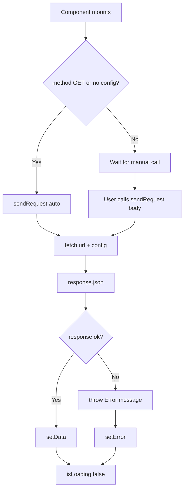

| Used in | URL | Method | Auto fetch? |
|---------|-----|--------|-------------|
| `Meals.jsx` | `/meals` | GET | Yes |
| `Checkout.jsx` | `/orders` | POST | No — form submit par |

**File:** [`src/hooks/useHttp.js`](src/hooks/useHttp.js)

---

## 11. Backend architecture

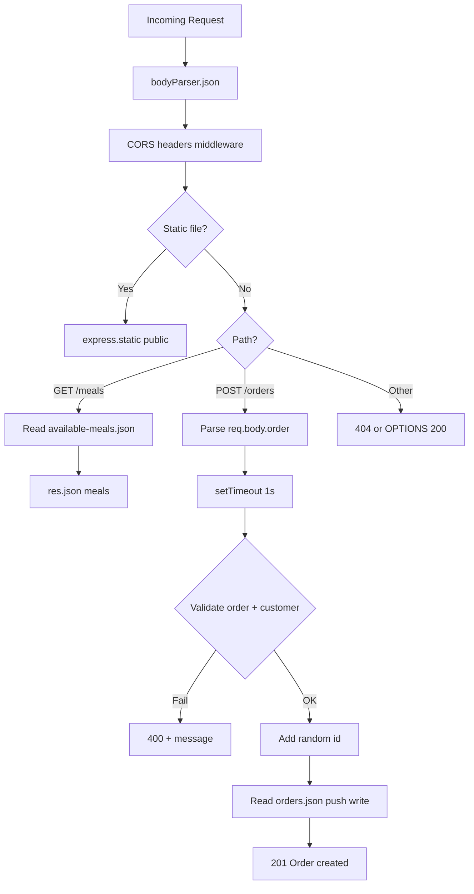

**File:** [`backend/app.js`](backend/app.js) — poora server ek file mein.

---

## 12. API reference (quick)

### GET `/meals`

| | |
|--|--|
| **Response** | `200` — array of meal objects |
| **Source** | `backend/data/available-meals.json` |

**Meal object example:**
```json
{
  "id": "m1",
  "name": "Mac & Cheese",
  "price": "8.99",
  "description": "...",
  "image": "images/mac-and-cheese.jpg"
}
```

### POST `/orders`

| | |
|--|--|
| **Body** | `{ "order": { "items": [...], "customer": {...} } }` |
| **Success** | `201` — `{ "message": "Order created!" }` |
| **Errors** | `400` — missing items or customer fields |

**Saved order shape:**
```json
{
  "id": "877.051...",
  "items": [ { "id": "m1", "quantity": 2, ... } ],
  "customer": {
    "name": "...",
    "email": "...",
    "street": "...",
    "postal-code": "...",
    "city": "..."
  }
}
```

---

## 13. Checkout flow (detailed)

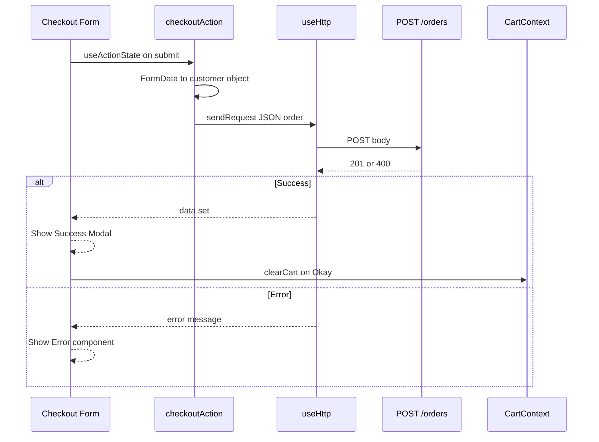

**Important:** Form field `id` values (`name`, `email`, `postal-code`, etc.) backend validation se **match** hone chahiye.

---

## 14. File-by-file explanation

### Frontend core

| File | Kya karta hai |
|------|----------------|
| [`main.jsx`](src/main.jsx) | React app `#root` par mount, `StrictMode`, CSS import |
| [`App.jsx`](src/App.jsx) | Dono providers wrap karke 4 main components render |
| [`index.css`](src/index.css) | Dark theme, grid layout, modal/button styles |

### Components

| File | Kya karta hai |
|------|----------------|
| [`Header.jsx`](src/components/Header.jsx) | Logo, title, **Cart (N)** button — total quantity sum |
| [`Meals.jsx`](src/components/Meals.jsx) | API se meals fetch, loading/error, list render |
| [`MealItem.jsx`](src/components/MealItem.jsx) | Card: image, price, description, **Add to Cart** |
| [`Cart.jsx`](src/components/Cart.jsx) | Cart modal, items list, total, Go to Checkout |
| [`CartItem.jsx`](src/components/CartItem.jsx) | Single line: name, qty × price, +/− buttons |
| [`Checkout.jsx`](src/components/Checkout.jsx) | Form, POST order, success/error UI |
| [`Error.jsx`](src/components/Error.jsx) | Red error box with title + message |
| [`Modal.jsx`](src/components/UI/Modal.jsx) | Portal + `<dialog>` |
| [`Button.jsx`](src/components/UI/Button.jsx) | Reusable button |
| [`Input.jsx`](src/components/UI/Input.jsx) | Label + input, `name={id}` for FormData |

### State & utilities

| File | Kya karta hai |
|------|----------------|
| [`CartContext.jsx`](src/store/CartContext.jsx) | Cart reducer + Provider |
| [`UserProgressContext.jsx`](src/store/UserProgressContext.jsx) | Modal open/close state |
| [`useHttp.js`](src/hooks/useHttp.js) | fetch wrapper |
| [`formatting.js`](src/util/formatting.js) | USD currency formatter |

### Backend

| File | Kya karta hai |
|------|----------------|
| [`app.js`](backend/app.js) | Express server, CORS, routes, validation |
| [`available-meals.json`](backend/data/available-meals.json) | 20 meals — menu source |
| [`orders.json`](backend/data/orders.json) | Saare placed orders ka log |

---

## 15. Data flow summary (ek diagram)

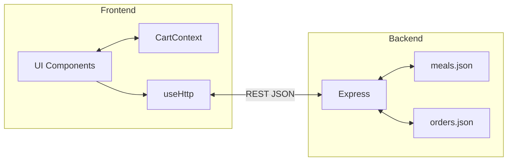

| Data | Direction | When |
|------|-----------|------|
| Meals list | Backend → Frontend | App load |
| Cart items | Memory only | Add/remove — no API |
| Order | Frontend → Backend | Checkout submit |
| Images | Backend static | Each meal card |

---

## 16. CORS — kyun zaroori hai

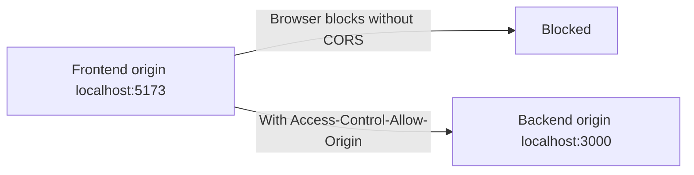

Browser **different ports** ko different origins maanta hai. Express middleware har response par headers set karta hai taaki frontend `fetch` kar sake.

---

## 17. Kaise run karein

**Terminal 1 — Backend:**
```bash
cd backend
npm install
npm start
```
Server: `http://localhost:3000`

**Terminal 2 — Frontend:**
```bash
npm install
npm run dev
```
App: `http://localhost:5173` (Vite default)

Dono ek saath chalne chahiye warna meals load nahi hongi.

---

## 18. Production vs current (honest picture)

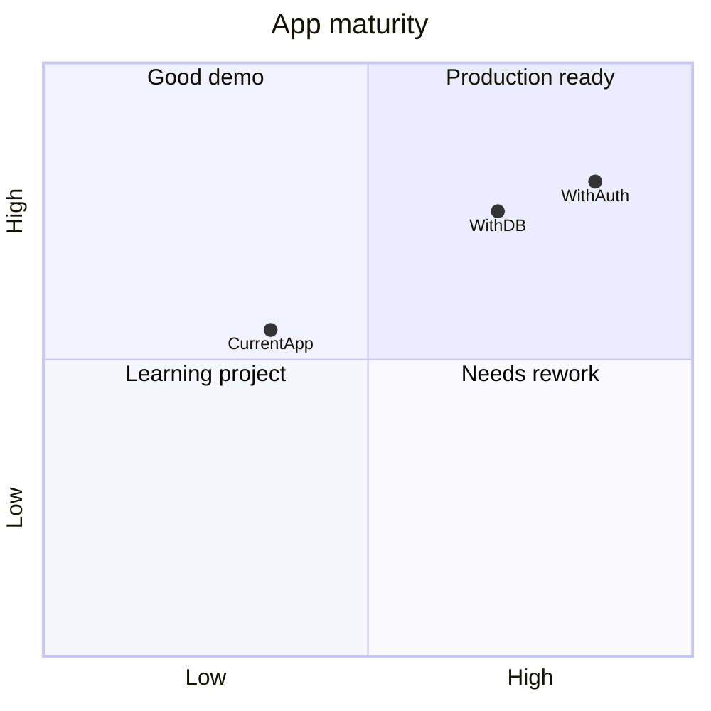

| Area | Abhi | Production mein |
|------|------|-------------------|
| Data | JSON files | PostgreSQL / MongoDB |
| Auth | None | JWT / sessions |
| Config | Hardcoded URLs | `.env` variables |
| Orders | Write-only | List, track, cancel APIs |
| Validation | Basic | Schema (Zod), server price check |
| Deploy | Local only | Vercel + Railway etc. |

---

## 19. Future improvements (roadmap)

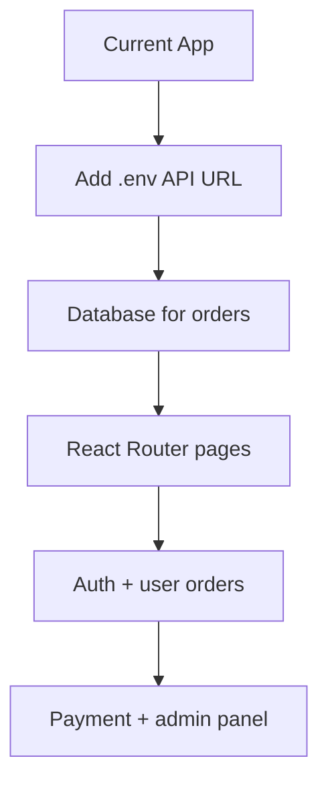

---

## 20. Cheat sheet — yaad rakhne wali lines

1. **2 servers** — Vite (UI) + Express (API)  
2. **2 contexts** — Cart data + modal progress  
3. **2 APIs** — GET meals, POST orders  
4. **2 JSON files** — menu + orders  
5. **Cart** server par tab touch hota hai jab order submit ho  
6. **Modals** = `<dialog>` + portal + `UserProgressContext`  
7. **Custom hook** `useHttp` = fetch + loading + error  

---

## Related docs

- **[INTERVIEW.md](INTERVIEW.md)** — 70+ interview Q&A (short answers)
- **[README.md](README.md)** — default Vite readme

---

*Last updated for project structure: React 19, Vite 4, Express 4, JSON storage.*
